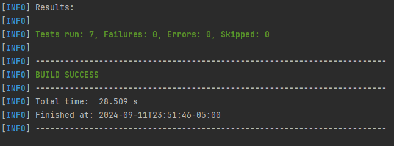

# AREP-VirtualizaciónLAB4

Este proyecto presenta un la aplicación web RoundRobin que utiliza varias tecnologías para garantizar eficiencia y escalabilidad. MongoDB, el cual se ejecuta en un contenedor Docker dentro de una máquina virtual EC2 en AWS, lo que proporciona una base de datos robusta.

### Requisitos

- Java JDK 17 o superior
- Apache Maven 3.9.6 (opcional, para gestionar dependencias)

## Arquitectura

### Cliente Servidor


## Componentes

### Cliente Web:
- **Interfaz de usuario**: Presenta un campo de texto y un botón.
- **Funcionalidad**: Al ingresar un texto y hacer clic en el botón, envía una solicitud HTTP al servicio de balanceo de carga.

### RoundRobin:
- **Balanceador de carga**: Implementa un algoritmo de Round Robin para distribuir las solicitudes de manera equitativa entre las instancias de LogService.
- **Servicio REST**: Recibe las solicitudes de la interfaz web, las enruta a una instancia de LogService específica y devuelve la respuesta al cliente.

### LogService:
- **Microservicio REST**:
   - **Recepción de datos**: Recibe cadenas de texto desde el balanceador de carga.
   - **Almacenamiento**: Almacena las cadenas en la base de datos MongoDB.
   - **Respuesta**: Devuelve un objeto JSON con las últimas 10 cadenas almacenadas y sus respectivas fechas.
- **Instancias múltiples**: El diagrama muestra tres instancias de LogService, lo que permite escalar horizontalmente la aplicación y mejorar la disponibilidad.

### MongoDB:
- **Base de datos NoSQL**: Almacena las cadenas de texto enviadas por los servicios LogService.
- **Contenedor Docker**: Se ejecuta dentro de un contenedor Docker para facilitar su gestión y despliegue.

### Docker Engine:
- **Motor de contenedores**: Gestiona los contenedores Docker que ejecutan los servicios de la aplicación.

### AWS EC2:
- **Máquina virtual**: Proporciona la infraestructura subyacente para ejecutar los contenedores Docker.

### Security Group:
- **Grupo de seguridad**: Define las reglas de firewall para controlar el tráfico entrante y saliente de la instancia EC2.

## Flujo de la Aplicación

1. El usuario ingresa un texto en la interfaz web y hace clic en el botón.
2. La solicitud HTTP se envía al balanceador de carga **APP-LB-RoundRobin**.
3. El balanceador de carga selecciona una instancia de **LogService** de acuerdo con el algoritmo **Round Robin**.
4. La instancia de **LogService** seleccionada recibe la solicitud, almacena la cadena en **MongoDB** y devuelve un objeto JSON con los últimos 10 registros.
5. El balanceador de carga reenvía la respuesta al cliente web.
6. La interfaz web actualiza la pantalla con la información recibida.

## Descripción de los componentes

### LogService
Esta parte de la aplicación permite recibir las peticiones del round robin haciendo uso de las anotaciones `@GetMapping` y `@RequestParam`, a su vez guarda el mensaje en la base de datos y devuelve el historial de los últimos 10 mensajes :
```bash
   @GetMapping("/message")
    public ResponseEntity<?> getMessage(@RequestParam String message) {
        Message newMessage = new Message(message);
        messageService.saveMessage(newMessage);
        try{
            return new ResponseEntity<>(messageService.getlastTenMessage(), HttpStatus.OK);
        }catch(Exception e) {
            return new ResponseEntity<>("{\"error\":\"Error al obtener los últimos 10 mensajes\"}", HttpStatus.INTERNAL_SERVER_ERROR);
        }
    }
  ```


### RoundRobin
Esta parte de la aplicación permite hacer peticiones al logService haciendo uso de las anotaciones `@GetMapping` y `@RequestParam`, gestionando las solicitudes de manera equitativa entre las instancias de LogService:  :
```bash
   @GetMapping("/round-robin")
    public ResponseEntity<String> sendMessage(@RequestParam String message) throws IOException {

        int currentIndex = index.getAndUpdate(i -> (i + 1) % logServiceUrls.size());
        String serviceUrl = logServiceUrls.get(currentIndex);

        String urlWithParams = serviceUrl + "?message=" + URLEncoder.encode(message, StandardCharsets.UTF_8.toString());

        URL url = new URL(urlWithParams);
        HttpURLConnection con = (HttpURLConnection) url.openConnection();
        con.setRequestMethod("GET");
        con.setRequestProperty("User-Agent", USER_AGENT);
        .........
  ```
## Instalación y ejecución

Para instalar y ejecutar esta aplicación, sigue los siguientes pasos:

1. **Clonar el repositorio:**

   ```bash
   git clone https://github.com/Knight072/AREP-VirtualizacionLAB4.git
   cd AREP-taller4
   ```

2. **Compilar y ejecutar:**

    ```bash
   mvn clean compile
   docker-compose up --build
   Esperar 5 minutos antes de probar la aplicación
   ```

3. **Abrir la aplicación en un navegador web:**

   Navega a http://localhost:8080/index.html para interactuar con la aplicación.

### Tests

Ejecutar el siguiente comando para iniciar las pruebas:

```bash
mvn test
```


### Construido con:

* [Git](https://git-scm.com) - Control de versiones
* [Maven](https://maven.apache.org/download.cgi) -  Manejador de dependencias
* [java](https://www.oracle.com/java/technologies/downloads/#java22) - Lenguaje de programación

## Versionado

Se uso [Git](https://github.com/) para control de versiones.

## Fecha

Wednesday, September 11, 2024
